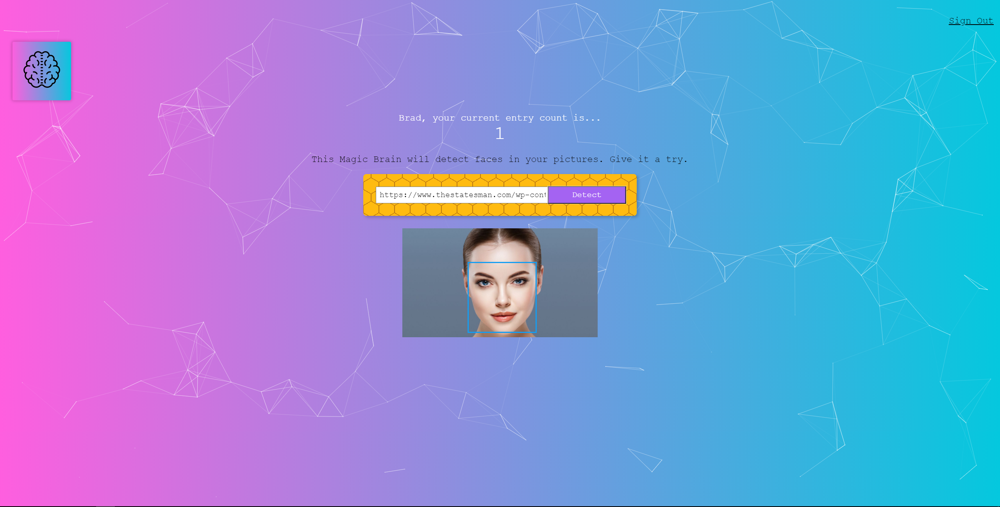

# Smart Brain API

Smart Brain is a web application that uses the Clarifai API to perform facial recognition on a user submitted image.

The API for smart-brain was built using Node.js, Express.js, and with user data stored in a PostgreSQL database. Passwords are stored as a hash using bcrypt.

A production version of the app can be accessed using: https://smart-brain-app12.herokuapp.com/

# NPM packages used
* Bcrypt
* Postgresql
* knex
* body parser
* cors
* express
